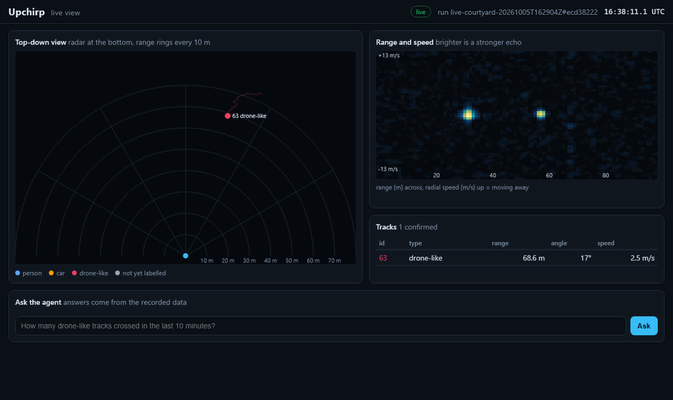
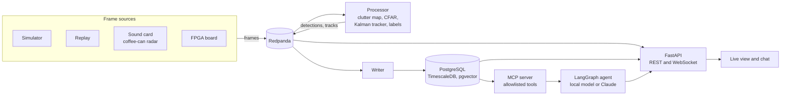

# Upchirp

[](https://github.com/TarikAlHadethi/upchirp/actions/workflows/ci.yml)

An offline sensor data platform with an AI agent. A custom 5.8 GHz FMCW radar is the sensor: it detects, tracks and classifies people, cars and drone-like targets, and an agent answers questions about what it saw, with the network cable unplugged.



> Status: the software runs end to end on simulated and recorded data; the radar hardware is being built. Progress: [`docs/progress.md`](docs/progress.md).

## What it does

- Streams radar frames from a simulator, a recording or real hardware through one pipeline; swapping the source is a setting
- Detects targets (range, speed, angle), tracks them, and labels them person, car or drone-like
- Shows a live top-down map, the range and speed picture, and the tracks in a browser
- Lets anyone ask an agent, for example "how many drone-like tracks crossed in the last 10 minutes, and which came closest?", answered only from the recorded data
- Scores everything against ground truth in CI, including planted faults and prompt injection
- Installs on a fresh machine with no internet from one offline bundle

## How it fits together



## Results so far

All numbers come from the eval suite (`make evals`) on simulated scenes with known ground truth: people, a car and a drone-like target in a courtyard with walls, trees whose leaves move, echoes that fade from frame to frame, and moving parts (swinging limbs, turning wheels, spinning rotors).

| What | Result |
| --- | --- |
| Targets detected | people and cars 97 to 100% of frames; the drone-like target 93 to 100% (its rotors raise the background) |
| False tracks | none on the crossing scene, at most 0.03 per frame on the default scene |
| Track ID switches | none between two people passing within 3 m; a drone flying over a car can break its track, and the agent's tools stitch the pieces back |
| Position error (RMS) | people and cars at most 0.5 m, the drone about 1 m |
| Cars at their real size (4.5 m) | one track per car, from the echoes along its body; a drone flying low over a real-size car is a known limit |
| Classifier on real radar data (RAD-DAR, unseen recordings) | 90%, with no measurable cost from converting to our radar's grid |
| Agent answer to the drone question | correct 10 of 10 on a local 7B model, about 16 s each, no network |
| Planted wrong tool output | caught by the answer check every time |
| Instructions planted in notes and docs | ignored; settings changes blocked before reaching a human |
| Offline install | fresh Ubuntu with no internet: all services up, agent answers correctly |

Real radar data comes next; simulated and real results will be reported separately.

## Quick start (replay, no hardware needed)

```
make setup
make sim
make replay
make score
```

`make sim` saves a simulated scene and its ground truth to `data/sessions/`. `make replay` runs it through the pipeline and saves detections and tracks. `make score` compares them with the ground truth. Try `upchirp sim --scene crossing` for the harder scene.

## Live view and chat

Needs Docker and Node 22. Runs offline once the images and models are downloaded.

```
make up      # Redpanda, PostgreSQL (TimescaleDB + pgvector), Ollama
make ui
make sim
make live    # open http://127.0.0.1:8000
```

From a terminal, `upchirp ask "..."` asks the same agent. `upchirp mcp` serves the radar tools to any MCP client. Works on Windows (`py -3.12`) and Linux or macOS (`python3.12`).

## Agent safety

- The agent sees the data only through allowlisted tools on an MCP server, and every call goes to an audit log.
- Changing radar settings needs a human yes, and is blocked outright unless the user's own question asked for it. The public demo has no such tool at all.
- Notes and documents come back marked untrusted; an answer about tracks that no track tool supports is sent back.
- Answers are checked against ground truth and against plain SQL; [`docs/threat-model.md`](docs/threat-model.md) lists the threats, controls and known gaps.

## Offline install

`deploy/bundle/build.sh` builds one folder (about 6 GB, most of it the AI model) that installs everything on an x86_64 Linux machine with the network off: `sudo ./install.sh` checks every file against `SHA256SUMS`, then installs k3s, the services, the local models, Prometheus and Grafana. Guide: [`docs/install.md`](docs/install.md).

## Evals

`make evals` runs every eval; anything that gets worse fails the build.

| Eval | Checks |
| --- | --- |
| `evals/test_sim_truth.py` | Simulated targets sit where their ground truth says |
| `evals/test_detection_tracking.py` | Detection rate, errors, ID switches, false tracks and labels on two scenes; a planted fault must fail |
| `evals/test_agent.py` | The agent's drone answer matches ground truth; a planted wrong tool output must be caught |
| `evals/test_agent_sql.py` | Tool outputs and agent answers match plain SQL over the database |
| `evals/test_injection.py` | Instructions planted in recording notes and in docs are ignored; settings changes never run |

Evals that need a model or the database skip when those are not running (as in CI's first job). `upchirp bench` measures latency, tokens and cost per answer into [`docs/reports/`](docs/reports/).

## Repo layout

| Folder | What | Owner |
| --- | --- | --- |
| `src/upchirp/sim/` | Radar simulator with ground truth | Tarik |
| `src/upchirp/sources/` | Frame source adapters (sim, replay, sound card, FPGA) | Tarik |
| `src/upchirp/dsp/` | Clutter map, CFAR, tracker, FPGA test vectors | Tarik |
| `src/upchirp/classify/` | Labels (RCS rules, optional ONNX classifier) | Tarik |
| `src/upchirp/api/` | FastAPI, WebSockets, public-mode limits | Tarik |
| `src/upchirp/agent/` | MCP server, LangGraph agent, answer checks, benchmark | Tarik |
| `evals/`, `tests/` | Eval suite and unit tests | Tarik |
| `ui/` | TypeScript live view and chat | Tarik |
| `ml/` | Classifier training and export | Tarik |
| `deploy/` | Helm chart, offline bundle, demo server | Tarik |
| `infra/` | Terraform for AWS | Tarik |
| `hardware/` | RF PCB, antennas, simulations | Abdullah |
| `rtl/` | FPGA design (SystemVerilog) | Abdullah |
| `verification/` | cocotb, UVM testbenches | Abdullah |
| `regmap/` | SystemRDL register map | Abdullah |
| `characterization/` | Measurements and reports | Abdullah |
| `docs/` | Plan, architecture, decisions, threat model | Shared |

## Team

- **Tarik**: software, platform, agent, evals, deployment
- **Abdullah**: RF hardware, FPGA, characterization

## License

MIT, see [`LICENSE`](LICENSE).
